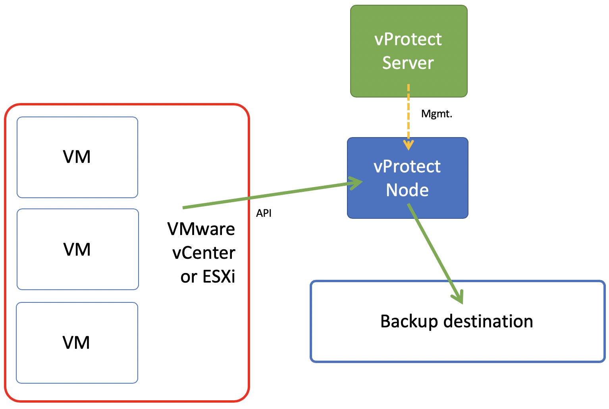

# Deployment in VMware vSphere/ESXi environment

vProtect supports VMware vCenter Server and VMware ESXi standalone hosts. **Backup Server** in this case is **vProtect Server. Data mover** is **vProtect Node.** Node can be installed on the separate machine or inside Proxy VM.

## Backup strategy

In the variant where node was installed on the Proxy VM, staging space must be located on a virtual disk attached to Proxy VM or using RDM.

This strategy uses NBD transport mode and supports incremental backups. Each disk of VM can be easily excluded from backup. Snapshot management is also available for VMware environment.

Backup process starts with creating snapshot. Next stage of this strategy is export of VM metadata and VM disks \(in RAW format\). After that, temporary snapshot is deleted to keep maximum efficiency of the VM.

