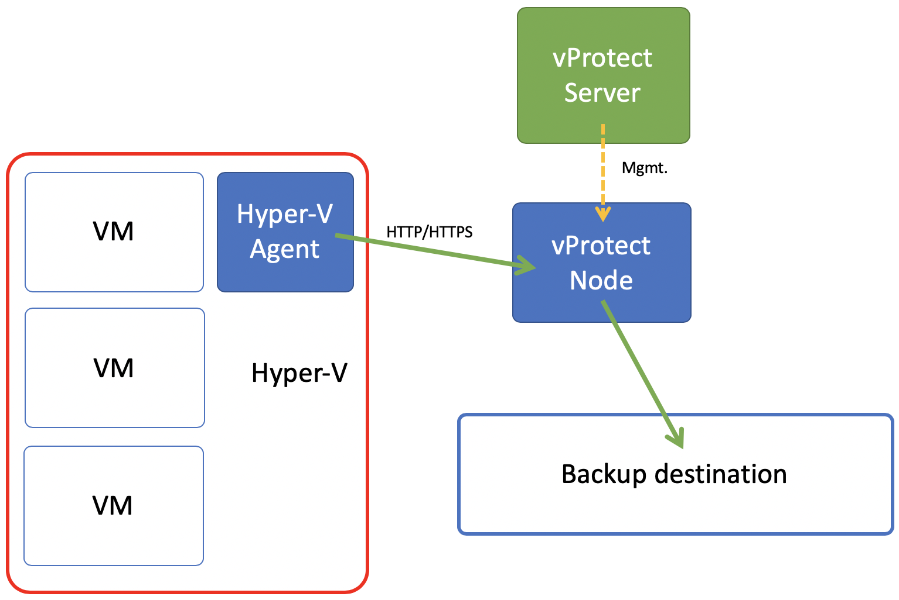

# Deployment in Microsoft Hyper-V environment

vProtect supports Hyper-V 2016+ environments. All backups are done via dedicated Hyper-V agent that needs to be installed on each Hyper-V host. 

Both full and incremental backups are supported. Data is being fetched by the agent and for incremental backups only changed blocks are being transferred \(**RCT** mechanism is being used\). No SMB/CIFS shares are needed. vProtect Node can be installed anywhere - it just needs to communicate with the agent on port **50881** \(HTTP\) or **50882** \(HTTPS\).

When you register hypervisors in vProtect - you actually are adding Hyper-V agents.

