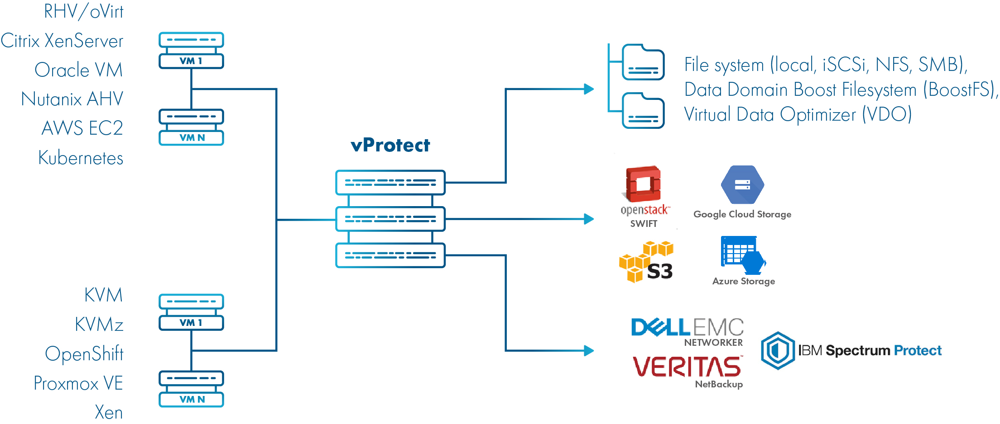

# Getting started

Before you proceed with installation please take a few minutes to read key concepts and requirements to properly plan installation.

## Architecture

High level picture: vProtect gets data from your virtualization platform and stores it backup provider of your choice. Notice, that one of the backup providers supported is just file-system \(which can be almost anything including these that support deduplication such as VDO\), which allows to use vProtect as a stand-alone solutions without third-party backup providers.

To be more precise - vProtect consists of 2 main components:

* **vProtect Server** - central point of vProtect management, provides administrative Web UI and APIs and  is a central repository of metadata
* **vProtect Node** - data mover - it does the dirty job: backups/restores/mounts
  * you can have multiple nodes doing actual backups/restores etc.
  * all of them are managed by the Server and need to be registered to the server

## Component placement

* vProtect Server and Node can be installed together - this is the most common case and 4 GB of RAM + 2 vCPU should be enough.
* Server can be installed anywhere \(physical box or VM\) - nodes just need to be able to connect to it.
* Nodes can be installed also inside a VM or physical box, but keep in mind that some backup strategies require Node to be installed as a VM on a Hypervisor Cluster \(especially when "disk attachment" export mode is mentioned\).
* Both components assume they are installed on a CentOS 7 minimal.

## Network considerations

* Critical for data transfer, so first you need to understand which paths are used for backups as in many cases you're going to use LAN. Depending on where node is located you need to verify if data is not going to pass via low-bandwidth links.
* Internet is in general not required, but during the installation `yum` needs to fetch packages from the repositories, so you need at least access to your internal repositories.
* **Storware Insight** \(enhancement allowing Storware to know about your problems earlier\) needs Internet access from the Server.
* Node needs access to the Server \(ports 443 or 8181 depending on the setup\).
* Node needs connectivity with backup providers \(if they are external, such as S3, IBM Spectrum Protect etc.\).
* Nodes needs connectivity with the Hypervisor or Hypervisor Manager.

## Installation options

For some platforms \(Citrix XenServer, oVirt/RHV, VMware\) you may use ready pre-configured Virtual Appliance downloadable from FTP. You should check corresponding sections here: [vProtect Virtual Machine deployment](../image/).

Other platforms require preparation of CentOS 7 VM or physical installation and following regular [Installation](../install/) steps.

## High level installation steps

1. Deploy VM image as described in [vProtect Virtual Machine deployment](../image/) **or** follow [Installation](../install/) steps
   * In any case - Node requires **staging space** - assume number of concurrent export and store tasks and multiply it by biggest VM size \(**for example:** 6 export tasks + 4 store tasks \* 100 GB should require around 1 TB\)
   * Virtual Appliance may not have the most recent version of the packages - we recommend to download RPMs from the FTP anyway and [Update](../update.md) if necessary
2. Now it is time for [Initial configuration](../initial_config/)
3. Add to your Hypervisor\(s\) or Hypervisor Manager\(s\) and initiate index to retrieve list of VMs, storage etc.:
   * by indexing Hypervisor Manager \(oVirt/RHV/Oracle VM/Nutanix Prism\) you'll have hypervisors added automatically. Other hypervisors are needed to be entered one by one \(KVM/Xen/Citrix XenServer/Proxmox VE\)
   * check appropriate sub-section for your platform: [Virtualization platforms](../initial_config/virtualization-platforms/)
4. Setup backup provider:
   * check appropriate sub-section for your provider: [Backup providers](../initial_config/backup-providers/)
   * we also recommend to check [Backup destinations](../admin_webui_overview/admin_webui_bd.md) section for detailed description of properties
5. Test basic operations to verify that integration is completed:
   * [How to backup](../admin_webui_overview/admin_webui_how_to_backup.md)
   * [How to restore](../admin_webui_overview/admin_webui_how_to_restore.md)
   * [How to mount](../admin_webui_overview/admin_webui_how_to_mount.md)
6. We recommend you also to read how to use [vProtect Web UI](../admin_webui_overview/) and [vProtect CLI](../admin_cli_overview/)

**Notice:** you may want to watch this [video](https://www.youtube.com/watch?v=c3PnfXG5Fs4), which presents a complete vProtect setup with several virtualization platforms and backup providers.

