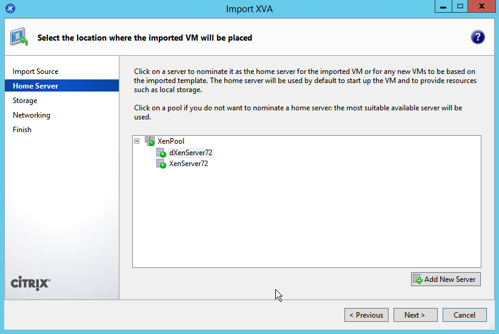

# vProtect Virtual Machine deployment on Citrix XenServer

Log in to Citrix XenServer, and import downloaded xva image:


Select vProtect.xva file:


Select pool, or XenServer host:



Select storage:


Select network:


Don't check "Start VM\(s\) after import", and finish import:


When virtual appliance with vProtect was imported select second disk "vProtect-storage", and go to "Properties".


Increase disk size, for vprotect staging space.


Start vProtect virtual machine, login, and incrase disk size \(in that example to 500G\):

```text
   vdo growLogical -n vprotect_data --vdoLogicalSize 500G
   xfs_growfs /dev/mapper/vprotect_data
```

After import image to enviroinment set IP addresation, run nmtui &gt; "Edit a connection".  
Select network interface, and edit it network settings.

You can find login credentials [here](./#default-login-and-password).

