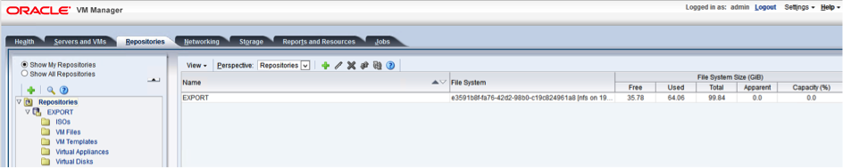

# Oracle VM setup

Oracle VM environments require storage repositories to be defined for each server pool and must be mounted on vProtect server.

1. Create repository from NFS share
   * one server pool should have separate subdirectory in export path i.e. `/vprotect_data/pool01`, `/vprotect_data/pool2` - each subdirectory is a separate NFS share
   * Export \(staging\) path in above-mentioned scenario is still `/vprotect_data`, while `pool01` and `pool02` are server pool names
   * specify mapping between server pool names and storage repository names in node configuration \(section `Hypervisor`\)
   * Note that export must be set to use UID and GID of `vprotect` user
   * Example export configuration in `/etc/exports` to the selected hypervisor in RHV cluster:

     ```text
     /vprotect_data    10.50.1.101(fsid=6,rw,sync,insecure,all_squash,anonuid=993,anongid=990)
     ```

     where `anonuid=993` and `anongid=990` should have correct UID and GID returned by command:

     ```text
     [root@vProtect3 ~]# id vprotect
     uid=993(vprotect) gid=990(vprotect) groups=990(vprotect)
     ```
2. Both import and export operations will be done using this NFS shares – restore will be done directly to this storage domain, so you can easily import backup into Oracle VM environment
   * backups must be restored to the export path \(node automatically changes names to the original paths that are recognized by OVM manager.



