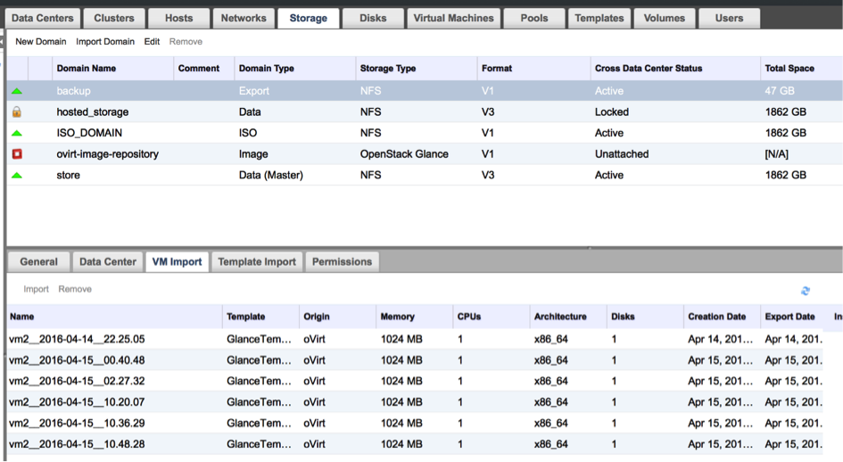

# RHV/oVirt setup

## RHV/oVirt \(API v4\)

For RHV/oVirt 4+ enviornments you can use API v4 for invoking all backup related tasks.

**Note**: RHV/oVirt API v4 environments require vProtect Node to be installed in one of the VMs residing on the RHV/oVirt cluster. vProtect should detect automatically the VM with vProtect during index operation.

During the backup/restore operations, disks are transsferred by attaching them to the proxy VM. This approach does not require export storage domain to be set up.

When adding oVirt/RHV 4.0+ HV managers make sure to have URL like the following:

```text
https://RHV_MGR_HOST/ovirt-engine/api
```

## RHV/oVirt \(API v3\)

RHV/oVirt 3.5.1+ environments \(using API v3\) require export storage domain to be set up.

1. Add backup storage domain in the RHEV/oVirt \(which points to the NFS export on vProtect Node\)
   * If you have multiple DC you need to enable `Multi DC export` checkbox in node configuration
     * Remember that you need to use named datacenters in your RHV/oVirt enviornment to avoid name conflicts
     * RHV/oVirt DC may use only one export storage domain, that is why you need to create subdirectories for each data center in export path i.e. `/vprotect_data/dc01`, `/vprotect_data/dc02`, and use each subdirectory as NFS share for each data center export domain \(separate NFS exports\).
     * Export \(staging\) path in above-mentioned scenario is still `/vprotect_data`, while `dc01` and `dc02` are datacenter names
     * Older versions of oVirt/RHV \(3.5.x\) require to specify mapping between DC names and export storage domains - you need to provide pairs of DC name and corresponding SD name in node configuration \(section `Hypervisor`\)
   * If you have only one DC and don't want to use multiple DC export feature in the future, you can use default settings, and setup NFS export pointing to the staging path \(e.g. `/vprotect_data`\)
   * Note that export must be set to use UID and GID of `vprotect` user
   * Example export configuration in `/etc/exports` to the selected hypervisor in RHV cluster:

     ```text
     /vprotect_data    10.50.1.101(fsid=6,rw,sync,insecure,all_squash,anonuid=993,anongid=990)
     ```

     where `anonuid=993` and `anongid=990` should have correct UID and GID returned by command:

     ```text
     [root@vProtect3 ~]# id vprotect
     uid=993(vprotect) gid=990(vprotect) groups=990(vprotect)
     ```
2. Both import and export operations will be done using this NFS share – restore will be done directly to this storage domain, so you can easily import backup into RHEV/oVirt \(shown below\)
   * backups must be restored to the export path \(node automatically changes names to the original paths that are recognized by RHV/oVirt manager.

  
3. When adding oVirt/RHV 4.0+ HV managers make sure to have URL like the following:

```text
https://RHV_MGR_HOST/ovirt-engine/api/v3
```

