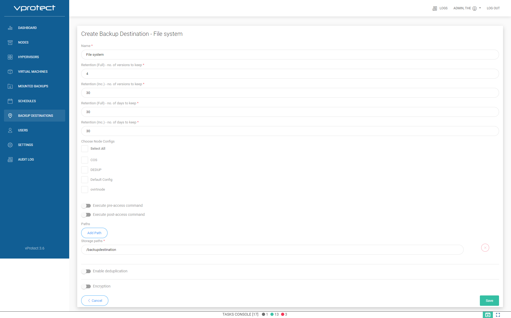
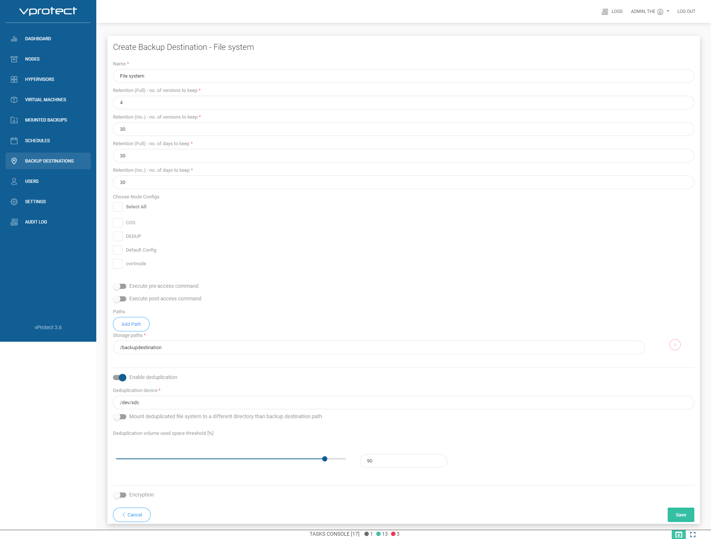

# File system setup

The following example assumes that you have a dedicated disk which you're going to use for backup destination. 

* Below you can find example with local XFS, where you need to prepare it manually
* Deduplication with VDO should be automatically initialized for you for storage smaller than 5 TB, for bigger volumes - let know support to help you.
* Any remote FS like **NFS, SMB, CephFS, etc.** - needs to be mounted by the user and vprotect user/group must own the directories within backup destination. vProtect expects just already mounted file system and mount point in the backup destination.
* Consider using same file system for staging and backup destination \(it boosts store tasks, as no data needs to be copied again\)

## Backup destination preparation

1. Log in to vProtect Node, and create mount directory in example `/backupdestination`

   ```text
      mkdir /backupdestination
   ```

   List all existing disk's, and found your new:

   ```text
      [root@vProtect01 ~]# fdisk -l | grep dev
      Disk /dev/sda: 32.2 GB, 32212254720 bytes, 62914560 sectors
      /dev/sda1   *        2048     1026047      512000   83  Linux
      /dev/sda2         1026048    62914559    30944256   8e  Linux LVM
      Disk /dev/sdc: 500 GB, 17179869184 bytes, 33554432 sectors
      Disk /dev/sdb: 21.5 GB, 21474836480 bytes, 41943040 sectors
      Disk /dev/mapper/centos-root: 28.5 GB, 28462546944 bytes, 55590912 sectors
      Disk /dev/mapper/centos-swap: 3221 MB, 3221225472 bytes, 6291456 sectors
   ```

   * These steps apply only **if you don't wan't use deduplication:**

     If you have new clean disk prepare filesystem on it:

     ```text
     mkfs.xfs -K /dev/sdc
     ```

     Mount your existing filesystem in created directory:

     ```text
     mount /dev/sdc /backupdestination
     ```

     Add permision for vprotect user to directory `/backupdestination`:

     ```text
     chown vprotect:vprotect -R /backupdestination
     ```

     Add line to `/etc/fstab` file, to automatically mount new filesystem after reboot:

     ```text
     /dev/sdc    /backupdestination    xfs    defaults 0 0
     ```

     If you want store backups on NFS share then you need add to `/etc/fstab`

     ```text
     10.50.1.28:/example_nfs_share /backupdestination nfs defaults  0 0
     ```

2. Login to vProtect, and go to "Backup Destinations". Click on "Create Backup Destination", chose "File system". Type name for new backup destination, and set retention. In "Storage paths" type `/backupdestination`.

   a\) Without deduplication example:



b\) With deduplication on backup destination only example:



c\) With deduplication and deduplicated staging space example:

In "Storage paths" type `/vprotect_data/backupdestination`. In "Mount deduplicated file system to a different directory than backup destination path" type `/vprotect_data`.


At the end save configuration.

