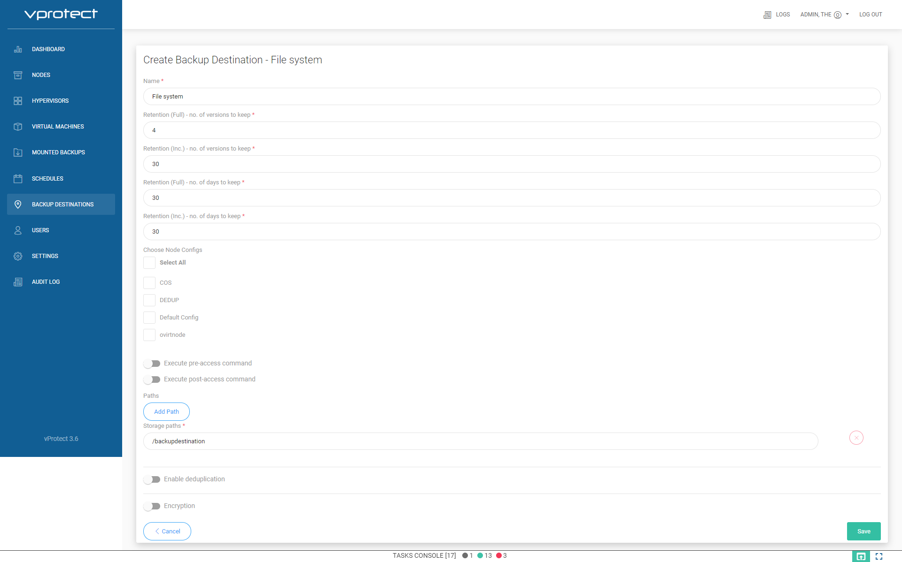
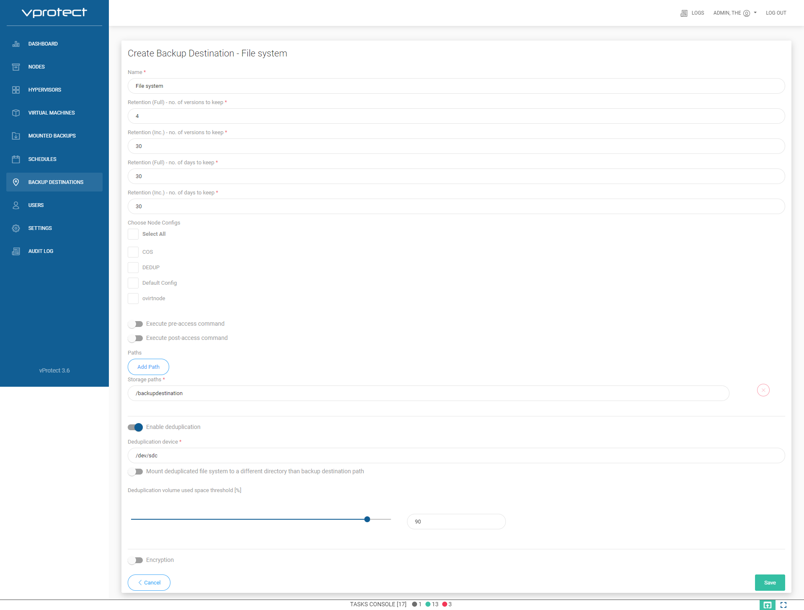

# Local File System setup

1. Prepare vProtect node:
	Log in to vProtect node, and create mount directory in example `/backupdestination`
	
	 ```text
      mkdir /backupdestination
     ```

	List all existing disk's, and found your new:
	
	 ```text
      [root@vProtect01 ~]# fdisk -l | grep dev
	  Disk /dev/sda: 32.2 GB, 32212254720 bytes, 62914560 sectors
	  /dev/sda1   *        2048     1026047      512000   83  Linux
	  /dev/sda2         1026048    62914559    30944256   8e  Linux LVM
	  Disk /dev/sdc: 500 GB, 17179869184 bytes, 33554432 sectors
	  Disk /dev/sdb: 21.5 GB, 21474836480 bytes, 41943040 sectors
	  Disk /dev/mapper/centos-root: 28.5 GB, 28462546944 bytes, 55590912 sectors
	  Disk /dev/mapper/centos-swap: 3221 MB, 3221225472 bytes, 6291456 sectors
     ```

	* Next steps only if you don't wan't use deduplication:
	 
	 If you have new clean disk prepare filesystem on it:
	
	 ```text
      mkfs.xfs -K /dev/sdc
     ```
	
	 Mount your existing filesystem in created directory:
	
	 ```text
      mount /dev/sdc /backupdestination
     ```

	 Add permision for vprotect user to directory `/backupdestination`:
	
	 ```text
      chown vprotect:vprotect -R /backupdestination
     ```
	 
	 Add line to `/etc/fstab` file, to automatically mount new filesystem after reboot:
   
   	 ```text
      /dev/sdc	/backupdestination	xfs	defaults 0 0
     ```
	
	 If you want store backups on NFS share then you need add to `/etc/fstab`
   
	 ```text
      10.50.1.28:/example_nfs_share /backupdestination nfs defaults  0 0
     ```
   
2. Login to vProtect, and go to "Backup Destinations".
	Click on "Create Backup Destination", chose "File system".
	Type name for new backup destination, and set retention.
	In "Storage paths" type `/backupdestination`.
	
	a) Without deduplication example:

	 

	b) With deduplication example:

	 

	c) With deduplication example, and deduplicated storage is staging directory:
	
	 In "Storage paths" type `/vprotect_data/backupdestination`.
	 In "Mount deduplicated file system to a different directory than backup destination path" type `/vprotect_data`.

	 
	
	At the end save configuration.