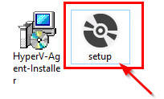
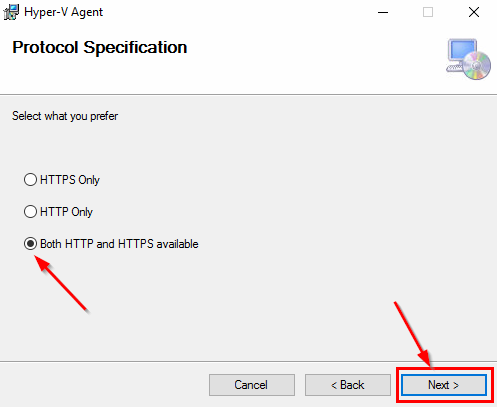

# Microsoft Hyper-v setup

1. From our FTP server ftp://ftp.storware.eu/Add-ons/ download **HyperV-Agent-Installer.msi**, and **setup.exe**.
2. Put installation files to Hyper-v host.
3. Run installation from **setup.exe**.

1. Click **Next** to proceed installation.

1. Type path to install Hyper-V Agent. And accept it by click **Next**.

1. Chose Protocol to communicate between agent, and vProtect node. And accept it by click **Next**.

1. Provide password for secure communication. And accept it by click **Next**.

1. Click **Next** to start installation.

1. If Windows UAC prompt you about installation, accept it by choose **Yes**.

1. Click **Finish** to end installation.

1. Go to **vProtect WebUI** &gt; **HYPERVISORS** &gt; **Hypervisors** click on button **+Add Hypervisor**.
2. In "Add New Hypervisor" window fill all fields: URL for https have port 50882, for http use port 50881. password - use the same what you set in installation agent process.

1. Click **Save** to finish adding your Hyper-v host. Repeat all steps for all Hyper-v hosts.

