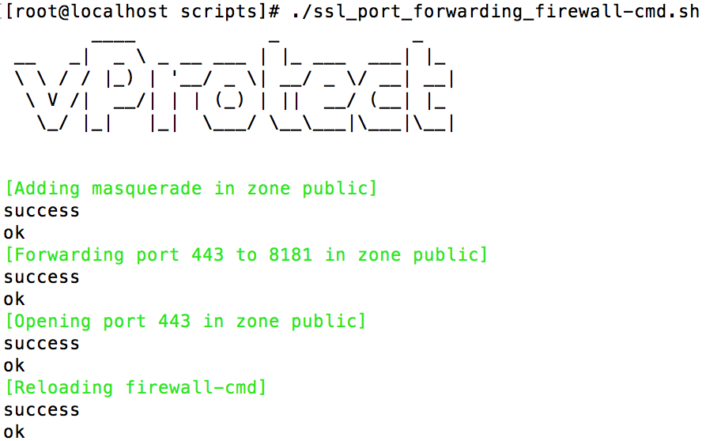

# Installation

## Prerequisites

1. Install CentOS 7 minimal
2. Make sure your OS is up to date:

   ```text
   yum -y update
   ```

   If kernel is updated, then You need to reboot your operating system.

3. Install EPEL repository

   * RedHat:

   ```text
   yum -y install https://dl.fedoraproject.org/pub/epel/epel-release-latest-$(rpm -E '%{rhel}').noarch.rpm
   ```

   * CentOS:

   ```text
   yum -y install epel-release
   ```

4. Install MariaDB repository \(vProtect Server host only\)
   * generate .repo file at [MariaDB download](https://downloads.mariadb.org/mariadb/repositories) site\)

     

   * copy and paste generated repo file into `/etc/yum.repos.d/MariaDB.repo`, so it looks similar to this:

     ```text
     # MariaDB 10.2 CentOS repository list - created 2017-10-03 07:45 UTC
     # http://downloads.mariadb.org/mariadb/repositories/
     [mariadb]
     name = MariaDB
     baseurl = http://yum.mariadb.org/10.2/centos7-amd64
     gpgkey=https://yum.mariadb.org/RPM-GPG-KEY-MariaDB
     gpgcheck=1
     ```

## vProtect Server installation

vProtect consists of server \(central management point with WebUI\) and one or multiple nodes \(which can be installed on the same host as server or on other machines\). First step is always to install server.

1. Copy vprotect-server RPM file to your machine and install it using YUM \(where `XXX` is a placeholder for the vProtect version\):

   ```text
   yum -y install vprotect-server-*.rpm
   ```

2. Setup DB for vProtect:

   ```text
   vprotect-server-configure
   ```

   

3. Start vProtect Server \(it can take around a minute for server to be started\):

   ```text
   systemctl start vprotect-server
   ```

4. You may need to open 8181 port on your firewall. Here is example:

   ```text
   firewall-cmd --add-port=8181/tcp --permanent
   firewall-cmd --complete-reload
   ```

   **or** if you prefer to have vProtect console running on default HTTPS port \(443\), there is a script in `/opt/vprotect/scripts` directory to setup forwarding from port 443 to 8181 for you:

   ```text
   cd /opt/vprotect/scripts
   ./ssl_port_forwarding_firewall-cmd.sh
   ```

   

5. Now you should be able to log into the web console using URL: `https://VPROTECT_HOST:8181`, where `VPROTECT_HOST` is hostname or IP of your vProtect Server
   * by default vProtect has one admin account - `admin` with password `vPr0tect` \(with zero\)
6. Optionally, if you are going to connect nodes running on remote hosts, please proceed with the steps related to the vProtect Server described in section: [Enabling HTTPS connectivity for remote nodes](install_https.md)

## vProtect Node installation

vProtect Node is component that executes all tasks.

1. Copy vprotect-node RPM file to your machine and install it using YUM \(where `XXX` is a placeholder for the vProtect version\):

   ```text
   yum -y install vprotect-node-*.rpm
   ```

2. Prepare your staging space \(on vProtect Node host only\):
   * size depends on the number and size of simultaneous backups - as a rule of a thumb make it aproximately equal to the number of expected simultaneous backup threads multiplied by the size of your biggest VM
   * it is also recommended to create a symlink `/vprotect_data` pointing to the mount point of the staging space, e.g.:

     ```text
     ln -s /mnt/staging /vprotect_data
     ```

   * make also sure that staging directory and symlink belong to user and group called `vprotect`:

     ```text
     chown -R vprotect:vprotect /vprotect_data
     ```
3. Register node with `NODE_NAME` of your choice `ADMIN_USER` user name which you would like to use and URL to vProtect API and provide password when prompted:
   * Syntax:

     ```text
     vprotect node -r NODE_NAME ADMIN_USER http(s)://VPROTECT_SERVER:PORT/api
     ```

   * If you are going to connect nodes running on remote hosts, please proceed with the steps related to the vProtect Node described in section: [Enabling HTTPS connectivity for remote nodes](install_https.md)
   * Example for default local installation - over HTTP \(port 8080\):

     ```text
     vprotect node -r node1 admin http://localhost:8080/api
     ```
4. Start vProtect Node:

   ```text
   systemctl start vprotect-node
   ```

   Now you should be able to see new entry in `Node` section of web UI with your node in RUNNING state.

5. Run script to configure OS for Node:

   ```text
   vprotect-node-configure
   ```

   

6. Reboot vProtect VM to apply OS-specific settings:

   ```text
   reboot
   ```

vProtect is installed - you can now proceed with the steps described in [initial configuration](../initial_config/).

