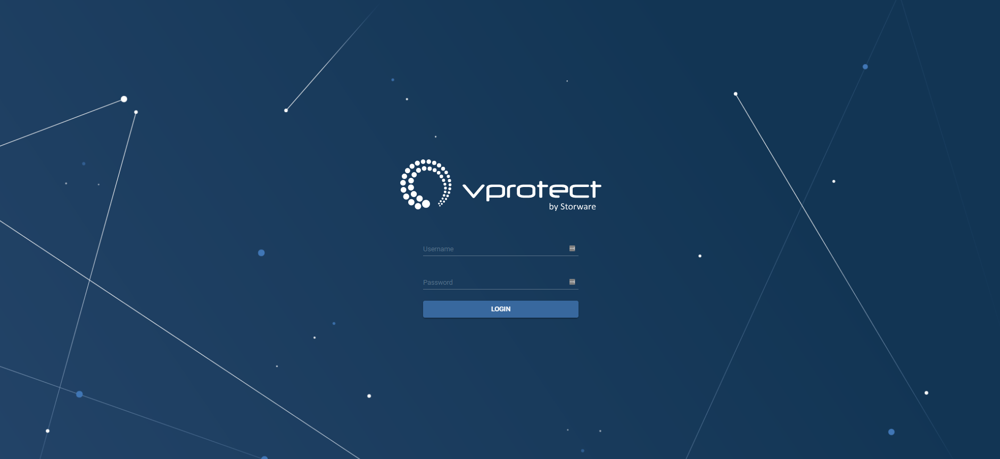

# High Availability

In this scenario, we are going to set up two vProtect servers in High Availability, Active/Passive mode. This is possible by using techniques such as pacemaker, corosync and DRBD. At least a basic understanding of these is highly desirable. This how-to is intended for RPM-based systems such as Red Hat / CentOS. If you run vProtect on different OS you may need to refer to your distribution docs.

Our environment is built of the following elements:

1. vprotect1 - first vProtect server + vProtect node, IP: 10.40.1.50
2. vprotect2 - second vProtect server + vProtect node, IP: 10.40.1.52
3. Cluster IP: 10.40.1.100 - We will use this IP to connect to our **active** vProtect service. This IP will float between our servers and will point to an active instance.
4. DRBD \(optionally with VDO\) for data replication and deduplication between nodes
5. MariaDB master &lt;-&gt; master replication


## HA cluster setup

### **Preparing the environment**

* Stop and disable **vProtect** server, node, database as the cluster will manage those resources

```text
systemctl disable vprotect-server vprotect-node mariadb
```

* **Use yum to check if you have any updates pending**

```text
# yum update
```

* It is a good idea to check _**/etc/hosts**_

  Especially if you have installed **vProtect** using _**All in one quick installation**_ method, you might find entry such as

  ```text
  127.0.0.1 <your_hostname_here>
  ```

  **delete it** as this prevents cluster from proper functioning \(your nodes will not "see" each other\).

Now we can proceed with installation of required packages.

* **On both servers run**

```text
# yum install -y pacemaker pcs psmisc policycoreutils-python
```

* **Add a firewall rule to allow HA traffic** - TCP ports 2224, 3121, and 21064, and UDP port 5405 \(both servers\)

```text
# firewall-cmd --permanent --add-service=high-availability
success
# firewall-cmd --reload
success
```

While testing, depending on your environment, you may encounter problems related to network traffic, permissions, etc. While it might be a good idea to temporarily disable the firewall and SELinux we do not recommend disabling that mechanism in the production environment as it creates significant security issues.  
**If you choose to disable firewalld bear in mind that vProtect won't be available on ports 80/443 anymore. Instead, connect to ports 8080/8181 respectively.**

```text
# setenforce 0
# sed -i.bak "s/SELINUX=enforcing/SELINUX=permissive/g" /etc/selinux/config
# systemctl mask firewalld.service
# systemctl stop firewalld.service
# iptables --flush
```

* **Enable and start PCS daemon**

```text
# systemctl enable pcsd.service
# systemctl start pcsd.service
```

**Cluster configuration**

Installation of pcs package earlier automatically created a user _**hacluster**_ with no password authentication. While this may be good for running locally we will require a pass for this account to perform the rest of the configuration, so let's

* **configure the same password on both nodes**

```text
# passwd hacluster
Changing password for user hacluster.
New password:
Retype new password:
passwd: all authentication tokens updated successfully.
```

**Corosync configuration**

* On node1 issue a command to authenticate as **hacluster** user:

```text
[root@vprotect1 ~]# pcs cluster auth vprotect1 vprotect2
Username: hacluster
Password:
vprotect1: Authorized
vprotect2: Authorized
```

* **Generate and synchronize corosync configuration**

```text
[root@vprotect1 ~]# pcs cluster setup --name mycluster vprotect1 vprotect2
```

​ Take a look at your output, should look similar to:

```text
Destroying cluster on nodes: vprotect1, vprotect2...
vprotect1: Stopping Cluster (pacemaker)...
vprotect2: Stopping Cluster (pacemaker)...
vprotect1: Successfully destroyed cluster
vprotect2: Successfully destroyed cluster

Sending 'pacemaker_remote authkey' to 'vprotect1', 'vprotect2'
vprotect1: successful distribution of the file 'pacemaker_remote authkey'
vprotect2: successful distribution of the file 'pacemaker_remote authkey'
Sending cluster config files to the nodes...
vprotect1: Succeeded
vprotect2: Succeeded

Synchronizing pcsd certificates on nodes vprotect1, vprotect2...
vprotect1: Success
vprotect2: Success
Restarting pcsd on the nodes in order to reload the certificates...
vprotect1: Success
vprotect2: Success
```

* **Enable and start your new cluster**

```text
[root@vprotect1 ~]# pcs cluster start --all && pcs cluster enable --all
vprotect1: Starting Cluster (corosync)...
vprotect2: Starting Cluster (corosync)...
vprotect1: Starting Cluster (pacemaker)...
vprotect2: Starting Cluster (pacemaker)...
vprotect1: Cluster Enabled
vprotect2: Cluster Enabled
```

OK! We have our cluster enabled. We have not created any resources \(such as floating IP\) yet, but before we proceed we still have a few settings to modify.

Because we are using only two nodes, we need to

* **disable default quorum policy**

\(this command should not return any output\)

```text
[root@vprotect1 ~]# pcs property set no-quorum-policy=ignore
```

We should also

* **define default failure settings**

```text
[root@vprotect1 ~]# pcs resource defaults failure-timeout=30s
[root@vprotect1 ~]# pcs resource defaults migration-threshold=3
```

Those two settings combined will define how many failures can occur for a node to be marked as ineligible for hosting a resource and after what time this restriction will be lifted off. We define defaults here, but it may be a good idea also to set these values also on resource level, depending on your experience.

As long we are not using any fencing device in our environment \(and here, we do not\) we need to:

* **disable stonith**

```text
[root@vprotect1 ~]# pcs property set stonith-enabled=false && crm_verify -L
```

The second part of this command verifies running-config. These commands normally do not return any output.

**Resources creation**

Finally, we have our cluster configured, so it's time to proceed to

* **resources creation**

At first, we will create a resource that represents our _**floating IP**_ 10.40.1.100. Adjust your IP and cidr\_netmask, and you're good to go.

**IMPORTANT:** From this moment we need to use this IP while connecting to our vProtect server.

```text
[root@vprotect1 ~]# pcs resource create "Failover_IP" ocf:heartbeat:IPaddr2 ip=10.40.1.100 cidr_netmask=22 op monitor interval=30s
```

Immediately we should see our IP up and running on one of the nodes \(most likely on the one we issued this command\).

```text
[root@vprotect1 ~]# ip a
[..]
2: ens160:  mtu 1500 qdisc mq state UP group default qlen 1000
    link/ether 00:50:56:a6:9f:c6 brd ff:ff:ff:ff:ff:ff
    inet 10.40.1.50/22 brd 10.40.3.255 scope global ens160
       valid_lft forever preferred_lft forever
    inet 10.40.1.100/22 brd 10.40.3.255 scope global secondary ens160
       valid_lft forever preferred_lft forever
    inet6 fe80::250:56ff:fea6:9fc6/64 scope link
       valid_lft forever preferred_lft forever
```

As you can see, our floating IP 10.40.1.100 has been successfully assigned as the second IP of interface ens160. This is what we wanted!

We should also check if vProtect web interface is up and running, we can do this by opening web browser and typing in [https://10.40.1.100](https://10.40.1.100/). At this point we should see:



As a next step

* **define a resource responsible for monitoring network connectivity**

```text
[root@vprotect1 ~]# pcs resource create ping ocf:pacemaker:ping dampen=5s multiplier=1000 host_list=10.40.0.1 clone
[root@vprotect1 ~]# pcs constraint location Failover_IP rule score=-INFINITY pingd lt 1 or not_defined pingd
```

Note that you need to use **your gateway IP** in _**host\_list**_ parameter

Finally we have to define a set of cluster resources responsible for other services crucial for vProtect operations such as vProtect Node and vProtect server itself. We will logically link those services with our floating IP. Whenever floating IP dissapears from our server, those services will be stopped. We also have to define the proper order for services to start and stop, as for example starting vProtect-server without the running database makes little sense.

* **Resource creation**

```text
[root@vprotect1 ~]#  pcs resource create "vProtect-node" systemd:vprotect-node op monitor timeout=300s on-fail="stop" --group vProtect-group
[root@vprotect1 ~]# pcs resource create "vProtect-server" service:vprotect-server op start on-fail="stop" timeout="300s" op stop timeout="300s" on-fail="stop" op monitor timeout="300s" on-fail="stop" --group vProtect-group
```

It is OK for those commands to not return any output.

* **Resource colocation**

```text
[root@vprotect1 ~]# pcs constraint colocation add Failover_IP with vProtect-group
```

At the end we can set determine which server is more preferred to run our services

* **Set node preference**

```text
[root@vprotect1 ~]# pcs constraint location Failover_IP prefers vprotect1=INFINITY
[root@vprotect1 ~]# pcs constraint location vProtect-group prefers vprotect1=INFINITY
```

We made it to the end. At this point our pacemaker HA cluster is functional.

However, there are still two things we need to consider, such as:

1. Creating DB replication
2. Setting up DRBD for /vprotect\_data \(optionally with VDO\)

#### Setting up VDO+DRBD

In this section, we will prepare our deduplicated and replicated filesystem mounted in /vprotect\_data.

Using deduplicated FS is optional but highly recommended. If you don't intend to use it, skip part regarding VDO configuration.

Note: If you are altering existing vProtect configuration it is very important to preserve /vprotect\_data contents and transfer it to the new filesystem. You may also need to re-create your backup\_destination if you previously had one in this directory. Setting up VDO and DRBD will cause all data to be wiped from the configured volume.

Installation is split in below steps, follow them to get the job done.

* **Stop vprotect server and node**

```text
# systemctl stop vprotect-server vprotect-node
```

No output means everything went OK.

* **On both nodes install required repositories and packages**

```text
# rpm --import https://www.elrepo.org/RPM-GPG-KEY-elrepo.org
# rpm -Uvh https://www.elrepo.org/elrepo-release-7.0-4.el7.elrepo.noarch.rpm
Retrieving https://www.elrepo.org/elrepo-release-7.0-4.el7.elrepo.noarch.rpm
Preparing...                          ################################# [100%]
Updating / installing...
   1:elrepo-release-7.0-4.el7.elrepo  ################################# [100%]
```

Next command can produce quite a few lines so, I've truncated the output, however the idea is simple: install drbd packages:

```text
[root@vprotect1 ~]# yum install -y kmod-drbd84 drbd84-utils

Installed:
drbd84-utils.x86_64 0:9.6.0-1.el7.elrepo                                               kmod-drbd84.x86_64 0:8.4.11-1.1.el7_6.elrepo
```

If you have not disabled SELinux and firewall, remember to

* **configure them on both nodes**

  ```text
  # semanage permissive -a drbd_t
  # firewall-cmd --add-port=7788/tcp --permanent
  success
  # firewall-cmd --complete-reload
  success
  ```

  Don't forget to repeat those steps on the second node

Now that we have necessary software installed we must prepare an identical size block device on both nodes. Block device could mean a hard drive, a hard drive partition, software RAID, LVM Volume, etc. In this scenario, we are going to use a hard drive connected as _**/dev/sdb**_.

To add a DRBD resource we create a file _**/etc/drbd.d/vprotect.res**_ with below content. Be sure to change "address" so it reflects your network configuration.

Also, node names \(vprotect1 and vprotect2\) must match your _**uname -n**_ output.

```text
resource replicate {
protocol C;
    on vprotect1 {
                device /dev/drbd0;
                disk /dev/sdb;
                address 10.40.1.50:7788;
                meta-disk internal;
        }
    on vprotect2 {
                device /dev/drbd0;
                disk /dev/sdb;
                address 10.40.1.52:7788;
                meta-disk internal;
        }
```

We have config in place, we can now create and bring our resource online

* **On both nodes run**

  ```text
  # drbdadm create-md replicate
  initializing activity log
  initializing bitmap (4800 KB) to all zero
  Writing meta data...
  New drbd meta data block successfully created.
  ```

  then bring the volume online

  ```text
  # drbdadm up replicate
  ```

  You can verify if the device is up & running by issuing

  ```text
  # lsblk
  NAME                    MAJ:MIN RM  SIZE RO TYPE MOUNTPOINT
  sda                       8:0    0   16G  0 disk
  ├─sda1                    8:1    0    1G  0 part /boot
  └─sda2                    8:2    0   15G  0 part
  ├─vg_vprotect-lv_root 253:0    0 13.4G  0 lvm  /
  └─vg_vprotect-lv_swap 253:1    0  1.6G  0 lvm  [SWAP]
  sdb                       8:16   0  150G  0 disk
  └─drbd0                 147:0    0  150G  1 disk
  ```

  However, if we check

  ```text
  [root@vprotect1 ~]# drbdsetup status replicate
  replicate role:Secondary
  disk:Inconsistent
  peer role:Secondary
  replication:Established peer-disk:Inconsistent
  ```

  we will notice we need to start synchronization before we can use our volume

* **On the first server run**

  ```text
  [root@vprotect1 ~]# drbdadm primary --force replicate
  [root@vprotect1 ~]# drbdsetup status replicate
  replicate role:Primary
  disk:UpToDate
  peer role:Secondary
  replication:SyncSource peer-disk:Inconsistent done:0.22
  ```

  This way we have successfully started the process of replication between servers with vprotect1 being synchronization source.

  If you don't want to create a VDO device, then create and mount your filesystem:

  ```text
  [root@vprotect1 ~]# mkfs.xfs -K /dev/drbd0
  [root@vprotect1 ~]# mount /dev/mapper/drbd0 /vprotect_data/ && chown -R vprotect:vprotect /vprotect_data
  ```

* **Create VDO volume** \(optional\)

  By issuing below command we will create a VDO volume called _**vdo\_data**_ and put in on the top our DRBD volume. Afterwards, we are formatting it with XFS and mounting in /vprotect\_data

  ```text
  [root@vprotect1 ~]# vdo create --name=vdo_data --device=/dev/drbd0 --vdoLogicalSize=400G --compression=enabled --deduplication=enabled
  Creating VDO vdo_data
  Starting VDO vdo_data
  Starting compression on VDO vdo_data
  VDO instance 0 volume is ready at /dev/mapper/vdo_data

  [root@vprotect1 ~]# mkfs.xfs -K /dev/mapper/vdo_data
  meta-data=/dev/mapper/vdo_data   isize=512    agcount=4, agsize=26214400 blks
      =                       sectsz=4096  attr=2, projid32bit=1
      =                       crc=1        finobt=0, sparse=0
  data     =                       bsize=4096   blocks=104857600, imaxpct=25
      =                       sunit=0      swidth=0 blks
  naming   =version 2              bsize=4096   ascii-ci=0 ftype=1
  log      =internal log           bsize=4096   blocks=51200, version=2
      =                       sectsz=4096  sunit=1 blks, lazy-count=1
  realtime =none                   extsz=4096   blocks=0, rtextents=0

  [root@vprotect1 ~]# mount /dev/mapper/vdo_data /vprotect_data/ && chown -R vprotect:vprotect /vprotect_data
  ```

* **Copy VDO config to the second node**

```text
[root@vprotect1 ~]# scp /etc/vdoconf.yml root@vprotect2:/etc/vdoconf.yml
```

* **Disable VDO automatic startup**

  As this resource will be managed by cluster we need to disable auto startup of this service _**on both nodes**_

  ```text
  # systemctl disable vdo
  ```

### Final cluster settings

At this point, we have three components set up. To utilize fully our HAcluster and eliminate the need for manual intervention we should add below resources and settings to our cluster.

Issue this commands only on one node as it will propagate to cluster settings.

```text
[root@vprotect1 ~]#  pcs cluster cib drbd_cfg
[root@vprotect1 ~]#  pcs -f drbd_cfg resource create replicate ocf:linbit:drbd \
         drbd_resource=replicate op monitor interval=10s --group fs_group

[root@vprotect1 ~]#  pcs -f drbd_cfg resource master replicateClone replicate \
         master-max=1 master-node-max=1 clone-max=2 clone-node-max=1 \
         notify=true --group fs_group

[root@vprotect1 ~]#  pcs -f drbd_cfg resource create vdo_resource ocf:heartbeat:vdo-vol volume=vdo_data --group fs_group
[root@vprotect1 ~]#  pcs -f drbd_cfg resource create fs_resource ocf:heartbeat:Filesystem device=/dev/mapper/vdo_data directory=/vprotect_data fstype=xfs  --group fs_group
[root@vprotect1 ~]#  pcs cluster cib-push drbd_cfg --config

[root@vprotect1 ~]#  pcs constraint colocation add vdo_resource with replicateClone
[root@vprotect1 ~]#  pcs constraint order start vdo_resource then fs_resource
[root@vprotect1 ~]#  pcs constraint order start replicateClone then vdo_resource
[root@vprotect1 ~]#  pcs constraint colocation add vProtect-group with fs_group
[root@vprotect1 ~]#  pcs constraint colocation add vdo_resource with replicateClone INFINITY with-rsc-role=Master
[root@vprotect1 ~]#  pcs constraint order promote replicateClone then start fs_group
```

In here we have created a temporary file _**drbd\_cfg**_ and inside this file, we added our drbd\_resource called _**replicate**_ plus a Master/Slave set for this resource.

Afterwards, we have the definition of vdo\_resource and fs\_resource in one fs\_group followed by an update of the cluster configuration.

As a second step, we have put in place several resource colocation and constraints which allowed us to control the order and existence of newly created resources.

We need still to

* Make sure that our node is pointed to a localhost address. Check the _**Nodes**_ UI section.


If node's IP is different than 127.0.0.1 delete the node and re-register using

```text
[root@vprotect1 ~]# vprotect node -e <Node_Name> admin http://127.0.0.1:8080/api
```

* copy our license and node information from first node to the second one:

```text
[root@vprotect1 ~]# scp -pr /opt/vprotect/.session.properties 
[root@vprotect1 ~]# scp -pr /opt/vprotect/license.key
```

### MariaDB replication

In this section we will cover how to setup master&lt;-&gt;master MariaDB replication.

* On both nodes, if you have firewall enabled allow communication on port **3306**

```text
# firewall-cmd --add-port=3306/tcp --permanent
# firewall-cmd --complete-reload
```

**Steps to run on first node vprotect1: 10.40.1.50**

This server will be the source of DB replication

* **Stop vprotect server, node and database**

```text
[root@vprotect1 ~]# systemctl stop vprotect-server vprotect-node mariadb
```

* **Edit config file**, enable binary logging, and start MariaDB again. Depending on your distribution config file location may vary, most likely it is /etc/my.cnf or /etc/my.cnf.d/server.cnf

  In _**\[mysqld\]**_ section add lines:

```text
[root@vprotect1 ~]# vi /etc/my.cnf.d/server.cnf
log-bin
server_id=1
replicate-do-db=vprotect
[root@vprotect1 ~]# systemctl start mariadb
```

* Now **login into your MariaDB**, create a user used for replication and assign appropriate rights to it.

  For the purpose of this task, we will set the username to 'replicator' and password to 'R3pLic4ti0N'

```text
[root@vprotect1 ~]# mysql -u root -p
Enter password:
[..]
MariaDB [(none)]> create user 'replicator'@'%' identified by 'R3pLic4ti0N';
Query OK, 0 rows affected (0.026 sec)

MariaDB [(none)]> grant replication slave on *.* to 'replicator'@'%';
Query OK, 0 rows affected (0.001 sec)

MariaDB [(none)]> FLUSH PRIVILEGES;
Query OK, 0 rows affected (0.001 sec)
```

Don't log out just yet, we need to check master status and

* **write down log file name and position**, as it is required for proper slave configuration.

```text
MariaDB [(none)]> show master status;
+----------------------+----------+--------------+------------------+
| File                 | Position | Binlog_Do_DB | Binlog_Ignore_DB |
+----------------------+----------+--------------+------------------+
| vprotect1-bin.000007 |    46109 |              |                  |
+----------------------+----------+--------------+------------------+
```

* Dump vprotect database and copy it onto the second server \(vprotect2\)

```text
 [root@vprotect1 ~]# mysqldump -u root -p vprotect > /tmp/vprotect.sql
 [root@vprotect1 ~]# scp /tmp/vprotect_rep.sql root@vprotect2:/tmp/
```

**Steps to run on 2nd server, vprotect2: 10.40.1.52**

For the reader's convenience, I only highlighted differences in configuration between vprotect1 and vprotect2 and omitted the output of some commands if they were the same as on the previous node.

* **Stop vprotect server, node and database**
* Edit MariaDB config file. **Assign different server id**, for example: 2. Then start MariaDB

```text
[root@vprotect2 ~]# vi /etc/my.cnf.d/server.cnf
log-bin
server_id=2
replicate-do-db=vprotect
[root@vprotect2 ~]# systemctl start mariadb
```

* **Load dump of the database** copied from vprotect1

```text
[root@vprotect2 ~]# mysql -u root -p vprotect < /tmp/vprotect.sql
```

At this point we have two exactly the same databases on our two servers.

* **Log in into MariaDB instance, create replication user with password**. Use the same user as on vprotect1. Grant necessary permissions.
* Set master host. You _**must**_ user\_master\_log\_file and master\_log\_pos written down before. Change IP of master host to match your network configuration.

```text
MariaDB [(none)]> STOP SLAVE;
MariaDB [(none)]> CHANGE MASTER TO MASTER_HOST = '10.40.10.50', MASTER_USER = 'replicator',MASTER_PASSWORD='R3pLic4ti0N',MASTER_LOG_FILE = 'vprotect1-bin.000007',MASTER_LOG_POS=46109;
Query OK, 0 rows affected (0.004 sec)
```

* Start slave, check master status and **write down file name and position**

```text
MariaDB [(none)]> start slave;
Query OK, 0 rows affected (0.001 sec)

MariaDB [(none)]> SHOW MASTER STATUS;
+----------------------+----------+--------------+------------------+
| File                 | Position | Binlog_Do_DB | Binlog_Ignore_DB |
+----------------------+----------+--------------+------------------+
| vprotect2-bin.000002 |   501051 |              |                  |
+----------------------+----------+--------------+------------------+
1 row in set (0.000 sec)
```

**Go back to the first server \(vprotect1\)**

* On **vprotect1** stop slave then change master host, use parameters noted in the previous step. Also, change  master host IP to match your network configuration.

```text
MariaDB [(none)]> stop slave;
MariaDB [(none)]> MariaDB [(none)]>  change master to master_host='10.40.1.52', master_user='replicator', master_password='R3pLic4ti0N',MASTER_LOG_FILE = 'vprotect2-bin.000002', master_log_pos=501051;
Query OK, 0 rows affected (0.004 sec)
MariaDB [(none)]> start slave;
Query OK, 0 rows affected (0.001 sec)
```

At this point, you have successfully configured MariaDB master&lt;-&gt;master replication.

#### Testing the setup

**Automatic**

The fastest way to test our setup is to invoke

```text
# pcs node standby vprotect1
```

to put vprotect1 into standby mode, which prevents it from hosting any cluster resources.

After a while, you should notice your resources being up on vprotect2.

Note that if you perform normal OS shutdown \(not a forced one\) pacemaker will wait for a long time for a node to come back online, which in fact will prevent shutdown completion. As a result, resources _**will not**_ switch correctly to the other node.

**Manual**

If you want to dive a little bit deeper, we prepared instructions on how to manually move filesystem resource from the first node to the second.

1. Stop vprotect services

   ```text
    systemctl stop vprotect-server && systemctl stop vprotect-node
   ```

2. Unmount FS used by DRBD/VDO on the primary server \(here vprotect1\)

   ```text
   [root@vprotect1 ~]# drbdadm role replicate
   Primary/Secondary
   [root@vprotect1 ~]# umount /vprotect_data/
   ```

3. If you have used VDO device, stop it.

   ```text
   [root@vprotect1 ~]# vdo stop -n vdo_data
   Stopping VDO vdo_data
   ```

4. Demote primary replication server \(still vprotect1\) to secondary

   ```text
   [root@vprotect1 ~]# drbdadm secondary replicate
   ```

**On the second server**

1. Promote second server \(here vprotect2\) to the primary DRBD role

   ```text
   [root@vprotect2 ~]# drbdadm    primary replicate
   ```

2. Start VDO

   ```text
   [root@vprotect2 ~]# vdo start -n vdo_data
   Starting VDO vdo_data
   Starting compression on VDO vdo_data
   VDO instance 2 volume is ready at /dev/mapper/vdo_data
   ```

3. Mount filesystem on the second server

   ```text
   [root@vprotect2 ~]# mount /dev/mapper/vdo_data /vprotect_data/
   ```

Now you have your replicated volume mounted on the second node.

