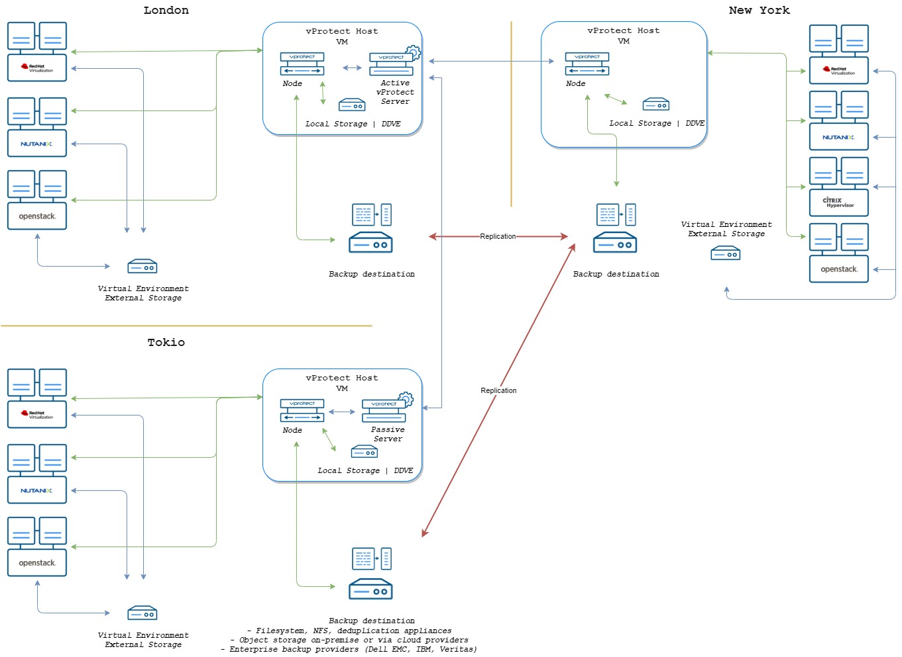

# Large

Environments of this size are the most difficult to describe because they introduce a large number of variables. Treat this more as a proof of concept which probably needs some tailoring to suit your specific needs.

* Network: minimum 10Gb/s
* Number of sites: 1+
* Number of **vProtect** installations: 2 server and \(min.\) + 2 nodes
* min. 8 vCPU and 16 GB RAM 
* Number of backup threads: 10 per node
* Backup window: 12 hours
* Data to back up: 25 TB+
* staging space:  your\_largest\_VM \* backup threads - per node
* Number of parallel backup threads: depending on number of virtual machines \(maximum 10 per node\)

