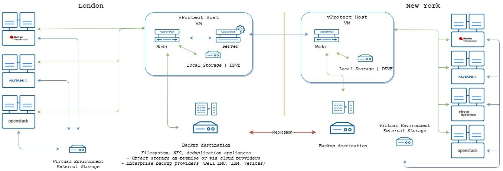

# Medium

* Network: minimum 10Gb/s
* Number of sites: 1
* Number of **vProtect** installations: 1 server and \(min.\) 1 node
* min. 4 vCPU and 8 GB RAM 
* Number of backup threads:  6 
* Backup window: 8 hours
* Data to back up: up to 25 TB
* staging space: your\_largest\_VM \* backup threads - per  node
* Number of parallel backup threads: depending on number of virtual machines \(maximum 10 per node\)

