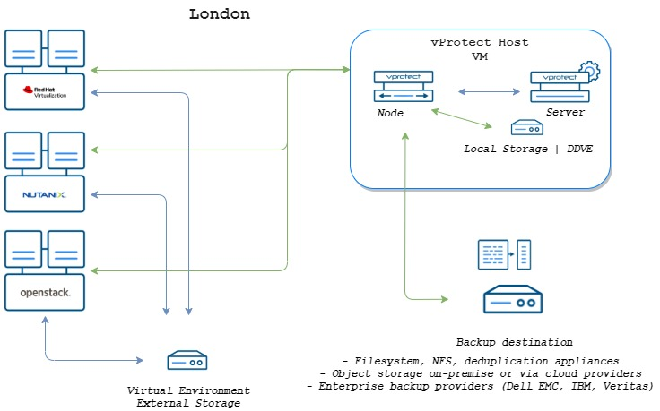

# Small

* Network: minimum 1Gb/s
* Number of sites: 1
* Number of **vProtect** installations: 1 server along with node
* vProtect min. 4 vCPU and 6 GB RAM 
* Number of backup threads: 3-4 \(default\)
* Backup window: 8 hours
* Data to backup: up to 2.5 TB
* staging space: your\_largest\_VM \* backup threads

As mentioned above, network speed is a very important factor. If you have a 1Gb/s connection between the server, node and backup clients, then during the 8 hours of the backup window we can assume that if we load the network at 70% of its capacity, we should transfer 2.5TB of data

In this scenario, **vProtect** \(server and node\) can, for example, be deployed as a VM using any of the installation methods.

