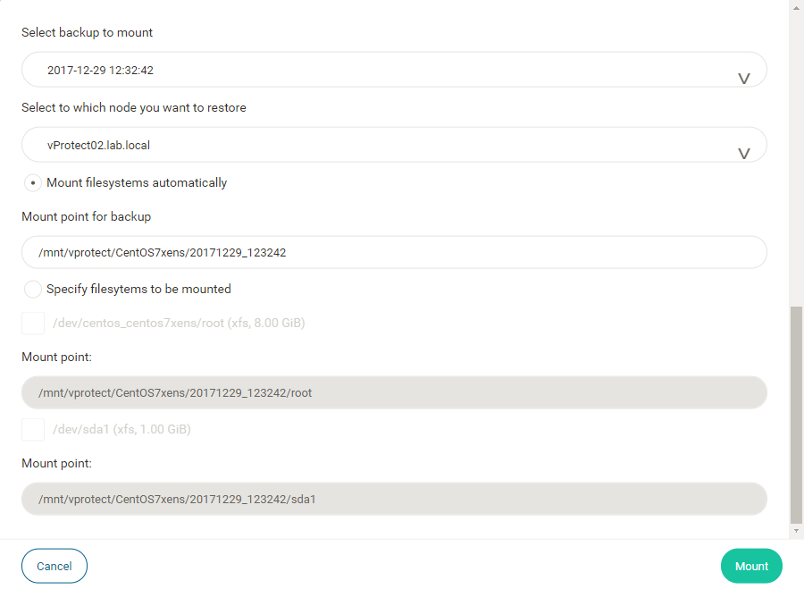

# How to mount

Open "VIRTUAL MACHINES" tab, and click on  to mount one VM. 

Next you can select date/time backup to mount, node to proceed restore job, auto or manual filesystem mount, and click . 

Now you can explore mounted filesystem, on vProtect node. 

If mounted backup is not required, then go to [mounted backups](mounted-backups.md), and unmount backup.

