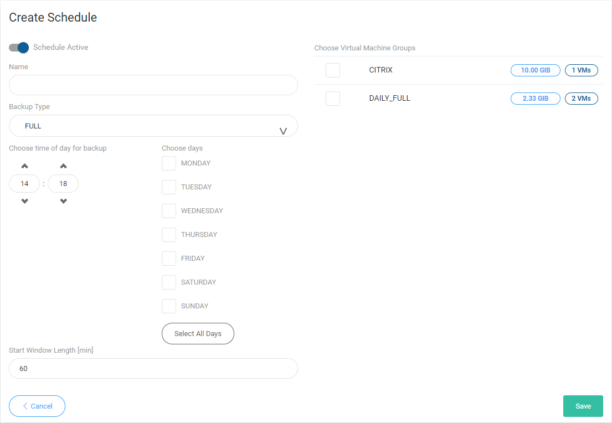

# Schedules

Schedule defines when and on which days VMs should be backed up. It has the following properties:

* `NAME` - schedule name
* `ACTIVE` - enable or disable executing schedule
* `HOUR` - defines when the task should be added to queue
* `DAYS` - defines days when task should be executed
* `BACKUP TYPE` - defines backup type full, or incremental
* `GROUPS` - associated VM groups with the schedule task
* `START WINDOW [MIN]` - defines how long the task should wait for being executed \(otherwise fails\)

To define new schedule use the  button i top-right corner, and provide above mentioned properties.

